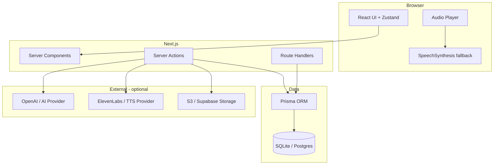

# Sora Calm — Architecture Overview

## 1. High-level architecture

| Layer | Responsibility |
|--------|------------------|
| **Next.js App Router** | Server components for data fetching; client components for player, motion, forms |
| **Server Actions & Route Handlers** | Mutations, AI/TTS orchestration, webhooks placeholder |
| **Prisma + SQLite (dev file)** | Users, content, preferences, history, logs; PostgreSQL optional in prod |
| **NextAuth (Auth.js v5)** | Email/password credentials; JWT sessions (no adapter in MVP) |
| **Abstractions** | `AiTextProvider`, `TtsProvider`, `StorageAdapter` — mock + env-backed implementations |
| **Stripe** | Stub: plans in DB + `subscriptionStatus` on user; pricing UI only |



## 2. Route map

| Path | Purpose |
|------|---------|
| `/` | Landing (marketing) |
| `/sign-in`, `/sign-up` | Auth |
| `/age-gate` | 21+ confirmation (cookie) |
| `/privacy` | Privacy summary (minimal data policy) |
| `/crisis` | Crisis / help resources |
| `/app/onboarding` | Multi-step onboarding |
| `/app/mood` | Mood check-in → recommendations |
| `/app` | Home dashboard |
| `/app/library` | Session library + filters |
| `/app/sessions/[slug]` | Session detail + transcript |
| `/app/play/[sessionId]` | Full player |
| `/app/favorites` | Saved sessions |
| `/app/recent` | Playback history |
| `/app/profile` | Profile & preferences |
| `/app/settings` | Subscription placeholder + disclaimer links |
| `/app/journal` | Journal prompts list / new entry |
| `/admin` | Content studio dashboard |
| `/admin/sessions` | CRUD sessions |
| `/admin/sessions/new` | Create + AI generator |
| `/admin/sessions/[id]/edit` | Edit, regenerate script/audio, logs |
| `/api/auth/[...nextauth]` | NextAuth |
| `/api/register` | Create account |
| `/api/analytics` | Lightweight event ingest |
| `/api/tts` | Optional TTS proxy (stub) |

**Route groups:** `(marketing)` for public shell; `(app)` for authenticated app with `AppShell`.

## 3. Database schema (Prisma)

- **User** — core identity; `subscriptionStatus`, `stripeCustomerId` (nullable)
- **Account**, **Session** (auth), **VerificationToken** — NextAuth
- **Profile** — display name
- **Preference** — onboarding flags, sensual content mode, lengths, voice tone, listening time
- **SessionCategory** — taxonomy
- **Session** (domain) — content entity (title, slug, descriptions, category, duration, intensity, tone, script JSON, voice style, audio URL, gradient, published, `freeTier`)
- **Tag**, **SessionTag** — tagging
- **Favorite** — user ↔ session
- **PlaybackHistory** — progress, completedAt
- **JournalEntry** — optional link to session
- **MoodCheckin** — mood enum string
- **SubscriptionPlan** — name, stripePriceId, feature flags JSON
- **AdminGenerationLog** — script/TTS runs

## 4. Component tree (key)

```
src/components/
  ui/                    # shadcn primitives (button, card, input, ...)
  app-shell.tsx          # Nav, mobile bottom bar, premium chrome
  gradient-card.tsx
  mood-chip.tsx
  session-card.tsx
  audio-player.tsx       # Sticky player, scrubber, speed, transcript, favorite, complete
  progress-ring.tsx
  empty-state.tsx
  section-header.tsx
  premium-badge.tsx
  soft-toggle.tsx
  voice-style-selector.tsx
  providers.tsx          # SessionProvider, theme
```

## 5. Content & safety

- Scripts stored as structured JSON (`ScriptSections` type); transcript = concatenation of sections.
- AI generation: server utility + `MockAiProvider` / `OpenAiProvider` (env).
- TTS: `MockTtsProvider` (silent/placeholder file), `OpenAiTtsProvider` or custom (env).
- Age gate cookie; crisis keywords route to `/crisis`; disclaimers in onboarding and settings.
- Sensual wellness: consent-first copy in seeds; user preference `sensualContentMode`: welcome | optional | hidden.

## 6. Analytics (hooks)

Client calls `/api/analytics` with event name + payload. Server validates session (optional) and can log to DB or stdout (MVP: console + optional table extension via `AdminGenerationLog` pattern — we use in-memory acceptable for MVP; implemented as simple API that logs).

*Implemented:* `lib/analytics.ts` `trackEvent()` posting to API; API writes to stdout and can be swapped for Segment etc.

## 7. Deployment

- **Vercel** + **Neon** or **Supabase** Postgres; set `DATABASE_URL`, `AUTH_SECRET`, `NEXTAUTH_URL`
- Run `prisma migrate deploy` on build; `db:seed` once
- Storage: start with local `/public/uploads` in dev; production use S3-compatible env vars

## 8. Mock mode

No `OPENAI_API_KEY` / TTS keys → mock providers return deterministic template output and placeholder audio path.

## 9. UX states & privacy

- **Route boundaries:** `loading.tsx` (skeletons via `AppRouteLoading` / `AdminRouteLoading`) and `error.tsx` (`RouteErrorPanel` with retry + safe copy) under `/app/**` and `/admin/**` segments.
- **Forms:** client mutations use **loading** (disabled control), **success** (`InlineSuccess`), and **error** (`InlineError`) where users need feedback.
- **Privacy:** `/privacy` documents data minimization; `lib/analytics.ts` instructs no PII in event payloads.

---

## File tree (target)

```
├── ARCHITECTURE.md
├── README.md
├── TODO.md
├── DEPLOYMENT.md
├── ADMIN.md
├── PROJECT_RULES.md
├── docs/
│   └── folder-structure.md
├── package.json
├── prisma/
│   ├── schema.prisma
│   ├── seed.ts
│   └── migrations/
├── public/
│   └── audio/
│       └── placeholder-silence.mp3   # optional; README notes
├── scripts/
│   └── screenshots.mjs               # Playwright or instructions
├── src/
│   ├── app/
│   │   ├── (marketing)/layout.tsx
│   │   ├── (marketing)/page.tsx
│   │   ├── age-gate/page.tsx
│   │   ├── crisis/page.tsx
│   │   ├── sign-in/page.tsx
│   │   ├── sign-up/page.tsx
│   │   ├── privacy/page.tsx
│   │   ├── layout.tsx
│   │   ├── globals.css
│   │   ├── (app)/app/...
│   │   ├── admin/...
│   │   └── api/...
│   ├── components/
│   │   ├── states/     # route + inline success/error helpers
│   │   └── ui/
│   ├── features/       # README for future feature modules
│   ├── lib/...
│   └── types/...
└── vitest.config.ts
```
